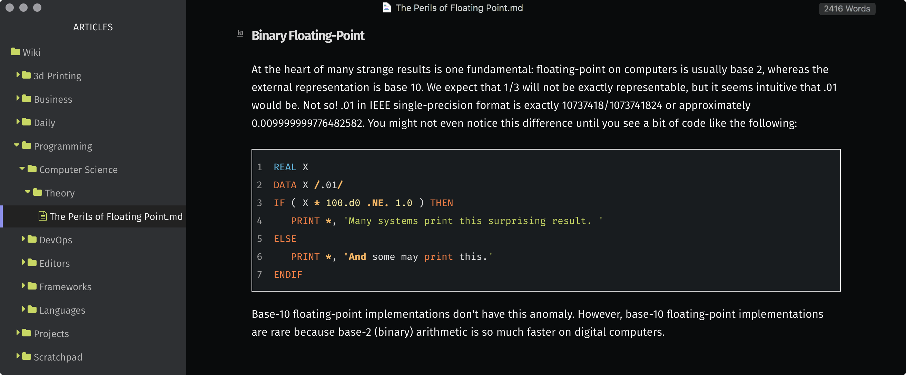

# chill-typora-theme
dark, laid back custom theme for typora.io

---

## Screenshot



---
## How to Install

1. Open Typora
1. Navigate to Typora > Preferences
1. When the dialog appears, click on 'Open Theme Folder' and copy/take note of the path.
1. Open Terminal and `cd` to the path we found in the last step. For example, for user `Bob` on `macOS`:
   ```bash
   cd '/Users/Bob/Library/Application Support/abnerworks.Typora/themes/'
   ```
1. Clone this repo and place it directly within the `/themes` directory:
    ```bash
    git clone https://github.com/outputs-io/chill-typora-theme.git .
    ```
1. Reload Typora
1. Navigate to Typora > Preferences
1. Change theme to 'Chill'

---

### Author
Made with &hearts; by [@droxey](https://github.com/droxey)
